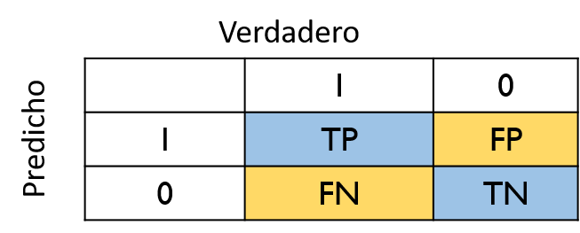

# Modelos de elección discreta


## Naturaleza del problema

- Muchos fenómenos económicos tienen que ver con decisiones que toman los agentes. Por ejemplo, si decide cursar estudios universitarios, $y=1$ o no, $y=0$. 

- Implica que para una muestra de datos podemos calcular la proporción de individuos que tomaron cada decisión. Esto sería el chance de que ocurra el evento

- A partir de los axiomas que definen la probabilidad, podemos deducir a partir de la probabilidad de un evento, $P(A)$, la probablidad de otro evento, $P(B)$

- Nos interesa modelar la probabilidad de ocurrencia del evento, la decisión, dadas determinadas circunstancias

## El modelo de probabilidad lineal

La variable dependiente representa la elección entre dos alternativas, A y B, para cada individuo $i$ se representa como

$$
\tag{1}
    y_i= 
\begin{cases}
    1,& \text{Si la alternativa A se elige}\\
    0,              & \text{Si la alternativa B se elige}
\end{cases}
$$


Escribimos el modelo como


$$
\tag{2}
y=\beta_0+\beta_1x_1+\beta_2x_2+...+\beta_3x_3+u
$$


Tomamos el valor esperado condicional


$$
E(y|\mathbf{x})=\beta_0+\beta_1x_1+...+\beta_kx_k+E(u|\mathbf{x})
$$


- Además, dada la naturaleza de $y$

$$
\tag{3}
E(y|\mathbf{x})=P(y=1|\mathbf{x})1+(1-P(y=1|\mathbf{x}))0
$$


Si, además se cumple exogeneidad estricta $E(u|\mathbf{x})$, entonces


$$
\tag{4}
P(y=1|\mathbf{x})=\beta_0+\beta_1x_1+...+\beta_kx_k
$$


En este modelo 


$$
\beta_j=\dfrac{\Delta P(y=1|\mathbf{x})}{\Delta x_j}
$$


Los parámetros los estimamos por MCO, y a partir de ello podemos obtener la probabilidad predicha


$$
\hat{y}=\hat{P}(y=1|\mathbf{x})=\hat{\beta_0}+\hat{\beta}_1x_1+...+\hat{\beta}_kx_k
$$


### Ejemplo

$$
    Auto_i= 
\begin{cases}
    1,& \text{Va en automóvil}\\
    0,              & \text{Va en bus}
\end{cases}
$$

Estima

$$
\hat{Auto}=0.48+0.0703T
$$


Donde $T=(TBus-TAuto)/10$ es el tiempo de desplazamiento en bus en relación al desplazamiento en automóvil


- Si $T=0$ entonces la probabilidad de ir en automóvil es 0.48


- Si $T$ pasa de $0$ a $1$, entonces la probabilidad se incrementa de $0.48$ a $0.55$


Probablidades por fuera del rango 0-1

### Heterocedasticidad en el LPM

Si $y_i=1$ entonces $\beta_0+\beta_{i1}x_1+...+\beta_kx_{ik}+u_i=1$, luego

<br/>

\begin{equation}
u_i=1-(\beta_0+\beta_1x_{i1}+...+\beta_kx_{ik})
\end{equation}


Y si $y_i=0$

\begin{equation}
u_i=-(\beta_0+\beta_1x_{i1}+...+\beta_kx_{ik})
\end{equation}


Luego $u_i$ toma dos valores, por lo tanto su varianza es

$$
Var(u|\mathbf{x})=P(X=1|\mathbf{x})[1-P(X=1|\mathbf{x})]=\sigma_i^2
$$


Es heterocedástica pues depende de los valores de $x$. Debemos usar errores estándar robustos


## Modelos Logit y Probit

### Especificación

En el modelo de probabilidad lineal modelamos la probabilidad de ocurrencia 


$$
P(y=1|\mathbf{x})=\beta_0+\beta_1x_1+...+\beta_kx_k
$$

- Sin embargo, sabemos que podemos obtener predicciones por fuera del intervalo $(0,1)$. 

- Para solucionarlo, usamos una función $0<G(z)<1$ para todos los números reales $z$


$$
\tag{5}
P(y=1|\mathbf{x})=G(\beta_0+\beta_1x_1+...+\beta_kx_k)
$$


Se suelen usar dos funciones de dsitribución acumulada para $G$: logística, normal. Recuerde que la CDF de la variable aleatoria $\mathbf{x}$ es $F_x(x)=P(\mathbf{x}\leq x)$

- Logística

$$
\tag{6}
G(z)=\dfrac{e^z}{1+e^z}=\Lambda(z)
$$

- Normal

$$
\tag{7}
G(z)=\Phi(z)=\int_{\infty}^z \phi(v)dv
$$


Donde

$$
\phi(z)=(2\pi)^{-1/2}e^{(-z^2/2)}
$$


### Función acumulada de distribución (CDF)


### Función acumulada de distribución (pdf)


$f_x(x)=\dfrac{F_x(x)}{dx}$


### Probablilidad predicha: LPM vs Probit


$\hat{Auto}=\Phi(-0.0064+0.3T)$


### Interpretación: efectos marginales

Llamamos $p(\mathbf{x})=P(y=1|\mathbf{x})$. Queremos calcular el cambio en la probabilidad de ocurrencia dado un cambio en $x_j$. 


 **Variable Continua**

$$
\tag{7}
\dfrac{\partial p(\mathbf{x})}{\partial x_j}=\dfrac{\partial G(z)}{\partial z}\beta_j
$$

- Para la logística es

$$
\dfrac{\partial G(z)}{\partial z}=\dfrac{e^z}{(1+e^z)^2}
$$

- Para la normal

$$
\dfrac{\partial G(z)}{\partial z}=\phi(z)
$$


**Variable Discreta**

Digamos que $x_1$ toma valores de $0$ y $1$

$$
\Delta p(\mathbf{x})=G(\beta_0+\beta_1+\beta_2x_2+...+\beta_kx_k)-G(\beta_0+\beta_2x_2+...+\beta_kx_k)
$$


En cualquier caso debemos decidir los valores de $\mathbf{x}$ en los que evaluamos la función $G$. Tenemos 3 opciones


**1.** MEM: Efecto marginal en la media $\bar{\mathbf{x}}=(\bar{x_1},...,\bar{x}_k)$


**2.** MER: Valor marginal en el un valor representativo: escoge los valores de $\mathbf{x}$ que quiera


**3.** AME: Efecto marginal promedio. Promediamos los efectos marginales individuales en la muestra. Este valor es similar al que se obtiene por LPM


#### AME

En el caso de variable continua

\begin{equation}
AME(x_j)=n^{-1}\beta_j\sum_{i=1}^n g(\beta_0+\beta_1x_{i1}+\beta_2x_{i2}+...+\beta_kx_{ik})
\end{equation}

Donde $g(z)=\dfrac{\partial G(z)}{\partial z}$


En el caso de variable discreta, supongamos $x_1$ es una dummy

\begin{equation}
AME(x_1)=n^{-1}\sum_{i=1}^n\Big(G(\beta_0+\beta_1+...+\beta_kx_k)-G(\beta_0+...+\beta_kx_k) \Big)
\end{equation}


- Es decir que para cada individuo se estima la probabilidad cuando $x_1=1$ y cuando $x_1=0$ y se toma la diferencia. En la terminología de contrafactuales esto sería el efecto de tratamiento promedio.


### Medidas de ajuste




- Correctamente predicho

$$
ACC=\dfrac{TP+TN}{TP+TN+FP+FN}
$$


- Sensibilidad (Tasa de verdadero positivo)

$$
S=\dfrac{TP}{TP+FN}=\dfrac{TP}{P}
$$


- Especificidad (tasa de verdadero negativo)


$$
SP=\dfrac{TN}{TN+FP}=\dfrac{TN}{N}
$$

## Ejercicio de aplicación

En la industria crediticia es muy importante identificar los factores que pueden dar lugar a que los deudores no honren a tiempo sus obligaciones, es decir que entren en *default*. Para ello usaremos los datos *vegas5.xlsx* que hacen parte del libro de texto *Principles of Econometrics*^[Carter, Griffiths, Lim, 2017, *Principles of econometrics*, 5th ed., Wiley & Sons]. Las variables son las siguientes


`<svg aria-hidden="true" role="img" viewBox="0 0 512 512" style="height:1em;width:1em;vertical-align:-0.125em;margin-left:auto;margin-right:auto;font-size:inherit;fill:currentColor;overflow:visible;position:relative;"><path d="M440.5 88.5l-52 52L415 167c9.4 9.4 9.4 24.6 0 33.9l-17.4 17.4c11.8 26.1 18.4 55.1 18.4 85.6 0 114.9-93.1 208-208 208S0 418.9 0 304 93.1 96 208 96c30.5 0 59.5 6.6 85.6 18.4L311 97c9.4-9.4 24.6-9.4 33.9 0l26.5 26.5 52-52 17.1 17zM500 60h-24c-6.6 0-12 5.4-12 12s5.4 12 12 12h24c6.6 0 12-5.4 12-12s-5.4-12-12-12zM440 0c-6.6 0-12 5.4-12 12v24c0 6.6 5.4 12 12 12s12-5.4 12-12V12c0-6.6-5.4-12-12-12zm33.9 55l17-17c4.7-4.7 4.7-12.3 0-17-4.7-4.7-12.3-4.7-17 0l-17 17c-4.7 4.7-4.7 12.3 0 17 4.8 4.7 12.4 4.7 17 0zm-67.8 0c4.7 4.7 12.3 4.7 17 0 4.7-4.7 4.7-12.3 0-17l-17-17c-4.7-4.7-12.3-4.7-17 0-4.7 4.7-4.7 12.3 0 17l17 17zm67.8 34c-4.7-4.7-12.3-4.7-17 0-4.7 4.7-4.7 12.3 0 17l17 17c4.7 4.7 12.3 4.7 17 0 4.7-4.7 4.7-12.3 0-17l-17-17zM112 272c0-35.3 28.7-64 64-64 8.8 0 16-7.2 16-16s-7.2-16-16-16c-52.9 0-96 43.1-96 96 0 8.8 7.2 16 16 16s16-7.2 16-16z"/></svg>`{=html} default: 1 si el individuo se ha retrasado en más de 90 días, 0 si no se ha retrasado. Esta es la variable dependiente

`<svg aria-hidden="true" role="img" viewBox="0 0 512 512" style="height:1em;width:1em;vertical-align:-0.125em;margin-left:auto;margin-right:auto;font-size:inherit;fill:currentColor;overflow:visible;position:relative;"><path d="M440.5 88.5l-52 52L415 167c9.4 9.4 9.4 24.6 0 33.9l-17.4 17.4c11.8 26.1 18.4 55.1 18.4 85.6 0 114.9-93.1 208-208 208S0 418.9 0 304 93.1 96 208 96c30.5 0 59.5 6.6 85.6 18.4L311 97c9.4-9.4 24.6-9.4 33.9 0l26.5 26.5 52-52 17.1 17zM500 60h-24c-6.6 0-12 5.4-12 12s5.4 12 12 12h24c6.6 0 12-5.4 12-12s-5.4-12-12-12zM440 0c-6.6 0-12 5.4-12 12v24c0 6.6 5.4 12 12 12s12-5.4 12-12V12c0-6.6-5.4-12-12-12zm33.9 55l17-17c4.7-4.7 4.7-12.3 0-17-4.7-4.7-12.3-4.7-17 0l-17 17c-4.7 4.7-4.7 12.3 0 17 4.8 4.7 12.4 4.7 17 0zm-67.8 0c4.7 4.7 12.3 4.7 17 0 4.7-4.7 4.7-12.3 0-17l-17-17c-4.7-4.7-12.3-4.7-17 0-4.7 4.7-4.7 12.3 0 17l17 17zm67.8 34c-4.7-4.7-12.3-4.7-17 0-4.7 4.7-4.7 12.3 0 17l17 17c4.7 4.7 12.3 4.7 17 0 4.7-4.7 4.7-12.3 0-17l-17-17zM112 272c0-35.3 28.7-64 64-64 8.8 0 16-7.2 16-16s-7.2-16-16-16c-52.9 0-96 43.1-96 96 0 8.8 7.2 16 16 16s16-7.2 16-16z"/></svg>`{=html} arm: dummy que indica si la tasa de interés es ajustable

`<svg aria-hidden="true" role="img" viewBox="0 0 512 512" style="height:1em;width:1em;vertical-align:-0.125em;margin-left:auto;margin-right:auto;font-size:inherit;fill:currentColor;overflow:visible;position:relative;"><path d="M440.5 88.5l-52 52L415 167c9.4 9.4 9.4 24.6 0 33.9l-17.4 17.4c11.8 26.1 18.4 55.1 18.4 85.6 0 114.9-93.1 208-208 208S0 418.9 0 304 93.1 96 208 96c30.5 0 59.5 6.6 85.6 18.4L311 97c9.4-9.4 24.6-9.4 33.9 0l26.5 26.5 52-52 17.1 17zM500 60h-24c-6.6 0-12 5.4-12 12s5.4 12 12 12h24c6.6 0 12-5.4 12-12s-5.4-12-12-12zM440 0c-6.6 0-12 5.4-12 12v24c0 6.6 5.4 12 12 12s12-5.4 12-12V12c0-6.6-5.4-12-12-12zm33.9 55l17-17c4.7-4.7 4.7-12.3 0-17-4.7-4.7-12.3-4.7-17 0l-17 17c-4.7 4.7-4.7 12.3 0 17 4.8 4.7 12.4 4.7 17 0zm-67.8 0c4.7 4.7 12.3 4.7 17 0 4.7-4.7 4.7-12.3 0-17l-17-17c-4.7-4.7-12.3-4.7-17 0-4.7 4.7-4.7 12.3 0 17l17 17zm67.8 34c-4.7-4.7-12.3-4.7-17 0-4.7 4.7-4.7 12.3 0 17l17 17c4.7 4.7 12.3 4.7 17 0 4.7-4.7 4.7-12.3 0-17l-17-17zM112 272c0-35.3 28.7-64 64-64 8.8 0 16-7.2 16-16s-7.2-16-16-16c-52.9 0-96 43.1-96 96 0 8.8 7.2 16 16 16s16-7.2 16-16z"/></svg>`{=html} refinance: 1 si el crédito es para refinanciar o si es para compra de inmueble

`<svg aria-hidden="true" role="img" viewBox="0 0 512 512" style="height:1em;width:1em;vertical-align:-0.125em;margin-left:auto;margin-right:auto;font-size:inherit;fill:currentColor;overflow:visible;position:relative;"><path d="M440.5 88.5l-52 52L415 167c9.4 9.4 9.4 24.6 0 33.9l-17.4 17.4c11.8 26.1 18.4 55.1 18.4 85.6 0 114.9-93.1 208-208 208S0 418.9 0 304 93.1 96 208 96c30.5 0 59.5 6.6 85.6 18.4L311 97c9.4-9.4 24.6-9.4 33.9 0l26.5 26.5 52-52 17.1 17zM500 60h-24c-6.6 0-12 5.4-12 12s5.4 12 12 12h24c6.6 0 12-5.4 12-12s-5.4-12-12-12zM440 0c-6.6 0-12 5.4-12 12v24c0 6.6 5.4 12 12 12s12-5.4 12-12V12c0-6.6-5.4-12-12-12zm33.9 55l17-17c4.7-4.7 4.7-12.3 0-17-4.7-4.7-12.3-4.7-17 0l-17 17c-4.7 4.7-4.7 12.3 0 17 4.8 4.7 12.4 4.7 17 0zm-67.8 0c4.7 4.7 12.3 4.7 17 0 4.7-4.7 4.7-12.3 0-17l-17-17c-4.7-4.7-12.3-4.7-17 0-4.7 4.7-4.7 12.3 0 17l17 17zm67.8 34c-4.7-4.7-12.3-4.7-17 0-4.7 4.7-4.7 12.3 0 17l17 17c4.7 4.7 12.3 4.7 17 0 4.7-4.7 4.7-12.3 0-17l-17-17zM112 272c0-35.3 28.7-64 64-64 8.8 0 16-7.2 16-16s-7.2-16-16-16c-52.9 0-96 43.1-96 96 0 8.8 7.2 16 16 16s16-7.2 16-16z"/></svg>`{=html} lien2: Si hay un segundo *lien* hipotecario toma el valor de 1, 0 si es el primer *lien*. Un *lien* hipotecario es el derecho que tiene el prestamista de tomar posesión del inmueble si el deudor entra en cesasión de pagos. 

`<svg aria-hidden="true" role="img" viewBox="0 0 512 512" style="height:1em;width:1em;vertical-align:-0.125em;margin-left:auto;margin-right:auto;font-size:inherit;fill:currentColor;overflow:visible;position:relative;"><path d="M440.5 88.5l-52 52L415 167c9.4 9.4 9.4 24.6 0 33.9l-17.4 17.4c11.8 26.1 18.4 55.1 18.4 85.6 0 114.9-93.1 208-208 208S0 418.9 0 304 93.1 96 208 96c30.5 0 59.5 6.6 85.6 18.4L311 97c9.4-9.4 24.6-9.4 33.9 0l26.5 26.5 52-52 17.1 17zM500 60h-24c-6.6 0-12 5.4-12 12s5.4 12 12 12h24c6.6 0 12-5.4 12-12s-5.4-12-12-12zM440 0c-6.6 0-12 5.4-12 12v24c0 6.6 5.4 12 12 12s12-5.4 12-12V12c0-6.6-5.4-12-12-12zm33.9 55l17-17c4.7-4.7 4.7-12.3 0-17-4.7-4.7-12.3-4.7-17 0l-17 17c-4.7 4.7-4.7 12.3 0 17 4.8 4.7 12.4 4.7 17 0zm-67.8 0c4.7 4.7 12.3 4.7 17 0 4.7-4.7 4.7-12.3 0-17l-17-17c-4.7-4.7-12.3-4.7-17 0-4.7 4.7-4.7 12.3 0 17l17 17zm67.8 34c-4.7-4.7-12.3-4.7-17 0-4.7 4.7-4.7 12.3 0 17l17 17c4.7 4.7 12.3 4.7 17 0 4.7-4.7 4.7-12.3 0-17l-17-17zM112 272c0-35.3 28.7-64 64-64 8.8 0 16-7.2 16-16s-7.2-16-16-16c-52.9 0-96 43.1-96 96 0 8.8 7.2 16 16 16s16-7.2 16-16z"/></svg>`{=html} term30: 1 si el plazo es de 30 años, 0 si es de 15 años

`<svg aria-hidden="true" role="img" viewBox="0 0 512 512" style="height:1em;width:1em;vertical-align:-0.125em;margin-left:auto;margin-right:auto;font-size:inherit;fill:currentColor;overflow:visible;position:relative;"><path d="M440.5 88.5l-52 52L415 167c9.4 9.4 9.4 24.6 0 33.9l-17.4 17.4c11.8 26.1 18.4 55.1 18.4 85.6 0 114.9-93.1 208-208 208S0 418.9 0 304 93.1 96 208 96c30.5 0 59.5 6.6 85.6 18.4L311 97c9.4-9.4 24.6-9.4 33.9 0l26.5 26.5 52-52 17.1 17zM500 60h-24c-6.6 0-12 5.4-12 12s5.4 12 12 12h24c6.6 0 12-5.4 12-12s-5.4-12-12-12zM440 0c-6.6 0-12 5.4-12 12v24c0 6.6 5.4 12 12 12s12-5.4 12-12V12c0-6.6-5.4-12-12-12zm33.9 55l17-17c4.7-4.7 4.7-12.3 0-17-4.7-4.7-12.3-4.7-17 0l-17 17c-4.7 4.7-4.7 12.3 0 17 4.8 4.7 12.4 4.7 17 0zm-67.8 0c4.7 4.7 12.3 4.7 17 0 4.7-4.7 4.7-12.3 0-17l-17-17c-4.7-4.7-12.3-4.7-17 0-4.7 4.7-4.7 12.3 0 17l17 17zm67.8 34c-4.7-4.7-12.3-4.7-17 0-4.7 4.7-4.7 12.3 0 17l17 17c4.7 4.7 12.3 4.7 17 0 4.7-4.7 4.7-12.3 0-17l-17-17zM112 272c0-35.3 28.7-64 64-64 8.8 0 16-7.2 16-16s-7.2-16-16-16c-52.9 0-96 43.1-96 96 0 8.8 7.2 16 16 16s16-7.2 16-16z"/></svg>`{=html} underwater: 1 si la deduda se estima en un valor mayor que el de la propiedad en el momento de originar el crédito

`<svg aria-hidden="true" role="img" viewBox="0 0 512 512" style="height:1em;width:1em;vertical-align:-0.125em;margin-left:auto;margin-right:auto;font-size:inherit;fill:currentColor;overflow:visible;position:relative;"><path d="M440.5 88.5l-52 52L415 167c9.4 9.4 9.4 24.6 0 33.9l-17.4 17.4c11.8 26.1 18.4 55.1 18.4 85.6 0 114.9-93.1 208-208 208S0 418.9 0 304 93.1 96 208 96c30.5 0 59.5 6.6 85.6 18.4L311 97c9.4-9.4 24.6-9.4 33.9 0l26.5 26.5 52-52 17.1 17zM500 60h-24c-6.6 0-12 5.4-12 12s5.4 12 12 12h24c6.6 0 12-5.4 12-12s-5.4-12-12-12zM440 0c-6.6 0-12 5.4-12 12v24c0 6.6 5.4 12 12 12s12-5.4 12-12V12c0-6.6-5.4-12-12-12zm33.9 55l17-17c4.7-4.7 4.7-12.3 0-17-4.7-4.7-12.3-4.7-17 0l-17 17c-4.7 4.7-4.7 12.3 0 17 4.8 4.7 12.4 4.7 17 0zm-67.8 0c4.7 4.7 12.3 4.7 17 0 4.7-4.7 4.7-12.3 0-17l-17-17c-4.7-4.7-12.3-4.7-17 0-4.7 4.7-4.7 12.3 0 17l17 17zm67.8 34c-4.7-4.7-12.3-4.7-17 0-4.7 4.7-4.7 12.3 0 17l17 17c4.7 4.7 12.3 4.7 17 0 4.7-4.7 4.7-12.3 0-17l-17-17zM112 272c0-35.3 28.7-64 64-64 8.8 0 16-7.2 16-16s-7.2-16-16-16c-52.9 0-96 43.1-96 96 0 8.8 7.2 16 16 16s16-7.2 16-16z"/></svg>`{=html} LTV: loan to value de la propiedad, en porcentaje

`<svg aria-hidden="true" role="img" viewBox="0 0 512 512" style="height:1em;width:1em;vertical-align:-0.125em;margin-left:auto;margin-right:auto;font-size:inherit;fill:currentColor;overflow:visible;position:relative;"><path d="M440.5 88.5l-52 52L415 167c9.4 9.4 9.4 24.6 0 33.9l-17.4 17.4c11.8 26.1 18.4 55.1 18.4 85.6 0 114.9-93.1 208-208 208S0 418.9 0 304 93.1 96 208 96c30.5 0 59.5 6.6 85.6 18.4L311 97c9.4-9.4 24.6-9.4 33.9 0l26.5 26.5 52-52 17.1 17zM500 60h-24c-6.6 0-12 5.4-12 12s5.4 12 12 12h24c6.6 0 12-5.4 12-12s-5.4-12-12-12zM440 0c-6.6 0-12 5.4-12 12v24c0 6.6 5.4 12 12 12s12-5.4 12-12V12c0-6.6-5.4-12-12-12zm33.9 55l17-17c4.7-4.7 4.7-12.3 0-17-4.7-4.7-12.3-4.7-17 0l-17 17c-4.7 4.7-4.7 12.3 0 17 4.8 4.7 12.4 4.7 17 0zm-67.8 0c4.7 4.7 12.3 4.7 17 0 4.7-4.7 4.7-12.3 0-17l-17-17c-4.7-4.7-12.3-4.7-17 0-4.7 4.7-4.7 12.3 0 17l17 17zm67.8 34c-4.7-4.7-12.3-4.7-17 0-4.7 4.7-4.7 12.3 0 17l17 17c4.7 4.7 12.3 4.7 17 0 4.7-4.7 4.7-12.3 0-17l-17-17zM112 272c0-35.3 28.7-64 64-64 8.8 0 16-7.2 16-16s-7.2-16-16-16c-52.9 0-96 43.1-96 96 0 8.8 7.2 16 16 16s16-7.2 16-16z"/></svg>`{=html} rate: tasa de interés sobre la deuda, porcentaje

`<svg aria-hidden="true" role="img" viewBox="0 0 512 512" style="height:1em;width:1em;vertical-align:-0.125em;margin-left:auto;margin-right:auto;font-size:inherit;fill:currentColor;overflow:visible;position:relative;"><path d="M440.5 88.5l-52 52L415 167c9.4 9.4 9.4 24.6 0 33.9l-17.4 17.4c11.8 26.1 18.4 55.1 18.4 85.6 0 114.9-93.1 208-208 208S0 418.9 0 304 93.1 96 208 96c30.5 0 59.5 6.6 85.6 18.4L311 97c9.4-9.4 24.6-9.4 33.9 0l26.5 26.5 52-52 17.1 17zM500 60h-24c-6.6 0-12 5.4-12 12s5.4 12 12 12h24c6.6 0 12-5.4 12-12s-5.4-12-12-12zM440 0c-6.6 0-12 5.4-12 12v24c0 6.6 5.4 12 12 12s12-5.4 12-12V12c0-6.6-5.4-12-12-12zm33.9 55l17-17c4.7-4.7 4.7-12.3 0-17-4.7-4.7-12.3-4.7-17 0l-17 17c-4.7 4.7-4.7 12.3 0 17 4.8 4.7 12.4 4.7 17 0zm-67.8 0c4.7 4.7 12.3 4.7 17 0 4.7-4.7 4.7-12.3 0-17l-17-17c-4.7-4.7-12.3-4.7-17 0-4.7 4.7-4.7 12.3 0 17l17 17zm67.8 34c-4.7-4.7-12.3-4.7-17 0-4.7 4.7-4.7 12.3 0 17l17 17c4.7 4.7 12.3 4.7 17 0 4.7-4.7 4.7-12.3 0-17l-17-17zM112 272c0-35.3 28.7-64 64-64 8.8 0 16-7.2 16-16s-7.2-16-16-16c-52.9 0-96 43.1-96 96 0 8.8 7.2 16 16 16s16-7.2 16-16z"/></svg>`{=html} amount: valor del crédito en unidades de $\$10,000$

`<svg aria-hidden="true" role="img" viewBox="0 0 512 512" style="height:1em;width:1em;vertical-align:-0.125em;margin-left:auto;margin-right:auto;font-size:inherit;fill:currentColor;overflow:visible;position:relative;"><path d="M440.5 88.5l-52 52L415 167c9.4 9.4 9.4 24.6 0 33.9l-17.4 17.4c11.8 26.1 18.4 55.1 18.4 85.6 0 114.9-93.1 208-208 208S0 418.9 0 304 93.1 96 208 96c30.5 0 59.5 6.6 85.6 18.4L311 97c9.4-9.4 24.6-9.4 33.9 0l26.5 26.5 52-52 17.1 17zM500 60h-24c-6.6 0-12 5.4-12 12s5.4 12 12 12h24c6.6 0 12-5.4 12-12s-5.4-12-12-12zM440 0c-6.6 0-12 5.4-12 12v24c0 6.6 5.4 12 12 12s12-5.4 12-12V12c0-6.6-5.4-12-12-12zm33.9 55l17-17c4.7-4.7 4.7-12.3 0-17-4.7-4.7-12.3-4.7-17 0l-17 17c-4.7 4.7-4.7 12.3 0 17 4.8 4.7 12.4 4.7 17 0zm-67.8 0c4.7 4.7 12.3 4.7 17 0 4.7-4.7 4.7-12.3 0-17l-17-17c-4.7-4.7-12.3-4.7-17 0-4.7 4.7-4.7 12.3 0 17l17 17zm67.8 34c-4.7-4.7-12.3-4.7-17 0-4.7 4.7-4.7 12.3 0 17l17 17c4.7 4.7 12.3 4.7 17 0 4.7-4.7 4.7-12.3 0-17l-17-17zM112 272c0-35.3 28.7-64 64-64 8.8 0 16-7.2 16-16s-7.2-16-16-16c-52.9 0-96 43.1-96 96 0 8.8 7.2 16 16 16s16-7.2 16-16z"/></svg>`{=html} fico: puntaje de crédito al momento de otorgamiento del crédito. 


## Estimaciones


**1.** Modelo de probabilidad lineal: estime la siguiente ecuación por MCO y con errores estándar robustos

$$
default=\beta_0+\beta_1arm+\beta_2refinance+\beta_3lien2+\beta_4term30+\beta_5underwater+\beta_6ltv+\beta_7rate+\beta_8amount+\beta_9fico+e
$$


Table: (\#tab:unnamed-chunk-6)LPM

|             | coefficient | Std. Error | t-value | p-value |
|:-----------:|:-----------:|:----------:|:-------:|:-------:|
| (Intercept) |    0.451    |   0.069    |  6.503  |  0.000  |
|     arm     |   -0.024    |   0.010    | -2.379  |  0.017  |
|  refinance  |   -0.048    |   0.010    | -4.965  |  0.000  |
|    lien2    |    0.182    |   0.026    |  6.962  |  0.000  |
|   term30    |   -0.017    |   0.014    | -1.223  |  0.221  |
| underwater  |    0.178    |   0.019    |  9.199  |  0.000  |
|     ltv     |    0.005    |   0.000    | 11.947  |  0.000  |
|    rate     |    0.040    |   0.003    | 15.484  |  0.000  |
|   amount    |    0.000    |   0.000    | -0.988  |  0.323  |
|    fico     |   -0.001    |   0.000    | -15.049 |  0.000  |

<br/>

Verifiquemos el comportamiento de los residuales. Hagamos la prueba de Breush-Pagan


```r
bptest(lpm1)
```

```

	studentized Breusch-Pagan test

data:  lpm1
BP = 772.52, df = 9, p-value < 2.2e-16
```

<br/>

Dado que tenemos evidencia de heterocedasticidad, procedemos a estimar el modelo con errores estándar robustos


```r
lpm1r<-coeftest(lpm1, vcov = vcovHC(lpm1, type="HC1"))
kable(tidy(lpm1r), digits=4, align='c',caption=
  "LPM", col.names=c("","coefficient", "Robust Std. Error", "t-value", "p-value"))
```


Table: (\#tab:unnamed-chunk-8)LPM

|             | coefficient | Robust Std. Error | t-value  | p-value |
|:-----------:|:-----------:|:-----------------:|:--------:|:-------:|
| (Intercept) |   0.4514    |      0.0681       |  6.6252  | 0.0000  |
|     arm     |   -0.0239   |      0.0102       | -2.3374  | 0.0194  |
|  refinance  |   -0.0483   |      0.0097       | -4.9711  | 0.0000  |
|    lien2    |   0.1821    |      0.0234       |  7.7859  | 0.0000  |
|   term30    |   -0.0174   |      0.0139       | -1.2553  | 0.2094  |
| underwater  |   0.1782    |      0.0147       | 12.1381  | 0.0000  |
|     ltv     |   0.0050    |      0.0004       | 13.0408  | 0.0000  |
|    rate     |   0.0400    |      0.0026       | 15.5933  | 0.0000  |
|   amount    |   -0.0002   |      0.0002       | -1.2463  | 0.2127  |
|    fico     |   -0.0011   |      0.0001       | -15.3711 | 0.0000  |

<br/>

Interprete los coeficientes

<br/>

**2.** Estime el modelo logit


```

Call:
glm(formula = default ~ arm + refinance + lien2 + term30 + underwater + 
    ltv + rate + amount + fico, family = "binomial", data = vegas5)

Deviance Residuals: 
    Min       1Q   Median       3Q      Max  
-2.1174  -0.9403  -0.6598   1.1405   2.7382  

Coefficients:
              Estimate Std. Error z value Pr(>|z|)    
(Intercept) -0.8306594  0.3495402  -2.376  0.01748 *  
arm         -0.1434127  0.0483486  -2.966  0.00301 ** 
refinance   -0.2404201  0.0476051  -5.050 4.41e-07 ***
lien2        1.2776049  0.1580227   8.085 6.22e-16 ***
term30      -0.0698832  0.0724898  -0.964  0.33503    
underwater   1.2418800  0.1213201  10.236  < 2e-16 ***
ltv          0.0254911  0.0021861  11.660  < 2e-16 ***
rate         0.1906607  0.0128088  14.885  < 2e-16 ***
amount      -0.0013225  0.0013039  -1.014  0.31045    
fico        -0.0052253  0.0003692 -14.154  < 2e-16 ***
---
Signif. codes:  0 '***' 0.001 '**' 0.01 '*' 0.05 '.' 0.1 ' ' 1

(Dispersion parameter for binomial family taken to be 1)

    Null deviance: 13178  on 9999  degrees of freedom
Residual deviance: 11912  on 9990  degrees of freedom
AIC: 11932

Number of Fisher Scoring iterations: 4
```

<br/>

**2.** Estime el modelo probit


```

Call:
glm(formula = default ~ arm + refinance + lien2 + term30 + underwater + 
    ltv + rate + amount + fico, family = binomial(link = "probit"), 
    data = vegas5)

Deviance Residuals: 
    Min       1Q   Median       3Q      Max  
-2.1129  -0.9454  -0.6634   1.1448   2.9244  

Coefficients:
              Estimate Std. Error z value Pr(>|z|)    
(Intercept) -0.3908903  0.2085569  -1.874  0.06089 .  
arm         -0.0844379  0.0293512  -2.877  0.00402 ** 
refinance   -0.1484383  0.0287391  -5.165  2.4e-07 ***
lien2        0.7400364  0.0890195   8.313  < 2e-16 ***
term30      -0.0374059  0.0432364  -0.865  0.38696    
underwater   0.7168854  0.0671228  10.680  < 2e-16 ***
ltv          0.0150133  0.0012924  11.617  < 2e-16 ***
rate         0.1140099  0.0076793  14.846  < 2e-16 ***
amount      -0.0007109  0.0007626  -0.932  0.35122    
fico        -0.0032324  0.0002224 -14.531  < 2e-16 ***
---
Signif. codes:  0 '***' 0.001 '**' 0.01 '*' 0.05 '.' 0.1 ' ' 1

(Dispersion parameter for binomial family taken to be 1)

    Null deviance: 13178  on 9999  degrees of freedom
Residual deviance: 11914  on 9990  degrees of freedom
AIC: 11934

Number of Fisher Scoring iterations: 5
```


**4.** Calcule el efecto marginal promedio para los modelos logit y probit. Use el paquete *margins*


```r
library(margins)
marglogit<-margins(mlogit)
marprobit<-margins(mprobit)
summary(marglogit)
```

```
     factor     AME     SE        z      p   lower   upper
     amount -0.0003 0.0003  -1.0145 0.3104 -0.0008  0.0003
        arm -0.0295 0.0099  -2.9705 0.0030 -0.0489 -0.0100
       fico -0.0011 0.0001 -14.7146 0.0000 -0.0012 -0.0009
      lien2  0.2624 0.0322   8.1595 0.0000  0.1994  0.3254
        ltv  0.0052 0.0004  11.9523 0.0000  0.0044  0.0061
       rate  0.0392 0.0025  15.5250 0.0000  0.0342  0.0441
  refinance -0.0494 0.0097  -5.0733 0.0000 -0.0685 -0.0303
     term30 -0.0144 0.0149  -0.9642 0.3349 -0.0435  0.0148
 underwater  0.2551 0.0246  10.3823 0.0000  0.2069  0.3032
```


```r
summary(marprobit)
```

```
     factor     AME     SE        z      p   lower   upper
     amount -0.0002 0.0003  -0.9323 0.3512 -0.0007  0.0003
        arm -0.0287 0.0099  -2.8800 0.0040 -0.0482 -0.0092
       fico -0.0011 0.0001 -15.0092 0.0000 -0.0012 -0.0010
      lien2  0.2511 0.0300   8.3826 0.0000  0.1924  0.3099
        ltv  0.0051 0.0004  11.8467 0.0000  0.0043  0.0059
       rate  0.0387 0.0025  15.3497 0.0000  0.0338  0.0436
  refinance -0.0504 0.0097  -5.1848 0.0000 -0.0694 -0.0313
     term30 -0.0127 0.0147  -0.8653 0.3869 -0.0414  0.0161
 underwater  0.2433 0.0225  10.8258 0.0000  0.1992  0.2873
```


**5.** Matriz de confusión


```r
vegas5<-vegas5%>%mutate(yhat=predict(mlogit,type="response"))
vegas5<-vegas5%>%mutate(defpred=ifelse(yhat>0.5,1,0))
table(vegas5$default,vegas5$defpred)
```

```
   
       0    1
  0 5427  874
  1 2304 1395
```


