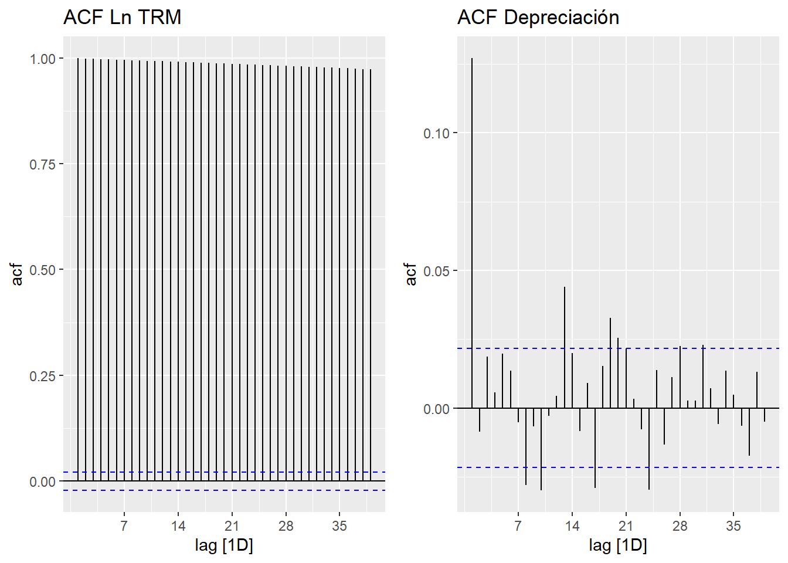
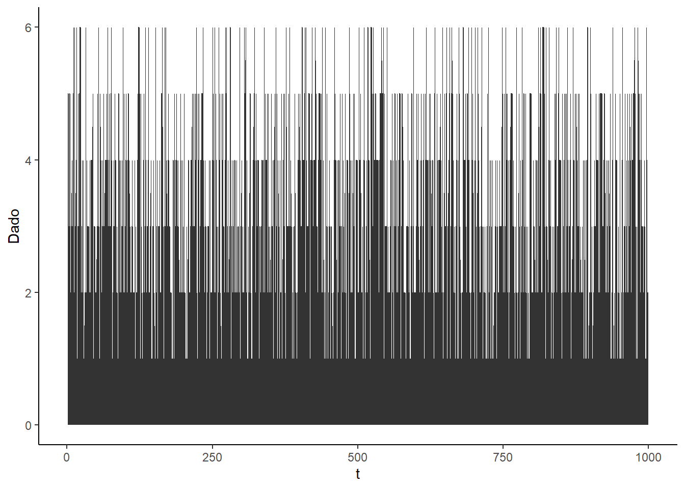

# Modelos con datos temporales: Introducción


## Introducción

Una serie de tiempo es un proceso ordenado secuencialmente en el tiempo. Decimos que $t$ es un entero que denota el periodo de tiempo. La mayoría de las series de tiempo de variables económicas se registran a intervalos discretos: anual, trimestral, mensual, diario. Decimos que el número de periodos observados por año define la frecuencia de la serie. 

Un aspecto crucial es la dependencia temporal de las observaciones qeu están cercanas en tiempo calendario. Por ejemplo, la tasa de inflación de junio está relacionada con la tasa de inflación de mayo. 


### Ejemplos


```r
library(fpp3)
library(readxl)
library(ggpubr)
piby<- read_excel(here("Econometria2","Data","pibyear.xlsx"))
piby<-tsibble(piby,index=year)
pib.plot<-ggplot(piby,aes(x=year,y=rgdpo))+geom_line()+labs(title="PIB",
                                                            y="USD (millones 2011)",x="")+theme_minimal()

piby<-piby%>%mutate(gpib=difference(log(rgdpo),lag=1)*100)
gpib.plot<-ggplot(piby,aes(x=year,y=gpib))+geom_line()+labs(title="Crecimiento",y="%",x="",caption="Penn World Tables")+theme_minimal()+geom_hline(yintercept=0)

ggarrange(pib.plot,gpib.plot,ncol=2)                                                            
```


```r
mes<- read_excel(here("Econometria2","Data","tsmonth.xlsx"))
mes<-mes%>%mutate(date=yearmonth(date))%>%as_tsibble(index=date)

ipc.plot<-ggplot(mes,aes(x=date,y=ipc))+geom_line()+labs(title="IPC",y="",x="")+theme_minimal()

inf.plot<-mes%>%mutate(inf=difference(log(ipc),lag=1)*100)%>%ggplot(aes(x=date,y=inf))+geom_line()+theme_minimal()+labs(title="Inflación Mensual",x="",y="",caption="DANE")

ggarrange(ipc.plot,inf.plot,ncol=2)
```


```r
mes%>%mutate(inf=difference(log(ipc),lag=1)*100)%>%
  gg_season(inf,labels="both")+
  labs(y="%",title="Gráfico estacional: inflación mensual",x="")
```


```r
ipcdcmp<-mes%>%model(stl=STL(ipc))
components(ipcdcmp)%>%autoplot()
```


```r
wti.plot<-ggplot(mes,aes(x=date,y=wti))+geom_line()+labs(title="WTI",y="US$/barril",x="")+theme_minimal()

gwti.plot<-mes%>%mutate(gwti=difference(log(wti),lag=1)*100)%>%ggplot(aes(x=date,y=gwti))+geom_line()+theme_minimal()+labs(title="Var mes WTI",x="",y="%",caption="IEA")

ggarrange(wti.plot,gwti.plot,ncol=2)
```


```r
trm<- read_excel(here("Econometria2","Data","tsdaily.xlsx"))
trm<-trm%>%mutate(date=ymd(date))%>%as_tsibble(index=date)

trm.plot<-ggplot(trm,aes(x=date,y=trm))+geom_line()+labs(title="TRM",y="COP/USD",x="")+theme_minimal()

dep.plot<-trm%>%mutate(dep=difference(log(trm),lag=1)*100)%>%ggplot(aes(x=date,y=dep))+geom_line()+theme_minimal()+labs(title="Depreciación",x="",y="%",caption="BanRep")

ggarrange(trm.plot,dep.plot,ncol=2)
```


## Autocorrelaciones

Para explorar el grado de dependencia entre la variable en el periodo $t$ y sus rezagos, $t-s$, usamos el coeficiente de correlación

$$
\rho_s=\dfrac{Cov(X_t,X_{t-s})}{Var(X_t)}
$$

Cuyo estimador muestral es

$$
\hat{\rho}_s=\dfrac{\sum_{t=s+1}^{T}(X_t-\bar{X})(X_{t-s}-\bar{X})}{\sum_{t=1}^{T}(X_t-\bar{X})^2}
$$


```r
acfpib<-piby%>%ACF(rgdpo)%>%autoplot()+labs(title="ACF PIB")
acfgpib<-piby%>%ACF(gpib)%>%autoplot()+labs(title="ACF Crecimiento PIB")
ggarrange(acfpib,acfgpib,ncol=2)
```


```r
acfipc<-mes%>%mutate(lipc=log(ipc))%>%ACF(lipc,lag_max=48)%>%autoplot()+labs(title="ACF Ln IPC")
acfinf<-mes%>%mutate(inf=difference(log(ipc),lag=1))%>%ACF(inf,lag_max=48)%>%autoplot()+labs(title="ACF Inflación")

ggarrange(acfipc,acfinf,ncol=2)
```


```r
acftrm<-trm%>%mutate(ltrm=log(trm))%>%ACF(ltrm)%>%autoplot()+labs(title="ACF Ln TRM")

acfdep<-trm%>%mutate(dep=difference(log(trm),lag=1))%>%ACF(dep)%>%autoplot()+labs(title="ACF Depreciación")

ggarrange(acftrm,acfdep,ncol=2)
```




## Ejercicio {-}

Para cada una de las series realice un análisis gráfico, lo que incluye la autocorrelación, de las variables en niveles y en diferencias. Trabaje con la serie en logaritmo cuando lo considere relevante

- ISE: índice de Seguimiento de la Economía. Serie de frecuencia mensual publicada por el [DANE](https://www.dane.gov.co/index.php/estadisticas-por-tema/cuentas-nacionales/indicador-de-seguimiento-a-la-economia-ise) 

- Tasa de desempleo total nacioanl. Serie de frecuencia mensual publidada por el [DANE](https://www.dane.gov.co/index.php/estadisticas-por-tema/mercado-laboral/empleo-y-desempleo)

- Precio de cierre de Bitcoin. Serie de frecuencia diaria. Se sugiere descargar los datos de Yahoo Finance usando el paquete *quantmod*


## Estacionariedad

Una proceso de serie de tiempo es una secuencia de variables aleatorias indexadas en el tiempo. Nuestros datos, lo que observamos, es una realización de este proceso estocástico. En analogía a los datos de sección cruzada, debemos tener en cuenta que nuestros datos son una realización de muchas posibles. 

Si tengo una colección de variables aleatorias ordenadas en una secuencia y muevo esa secuencia *h* periodos adelante y la distribución de probabilidad conjunta no cambia, entonces decimos que el proceso es estacionario.

**Ejemplo**

La variable aleatoria $Y_t$ toma el valor de la cara superior en el lanzamiento de un dato en $t$. Realiza 1000 lanzamientos sucesivos. Genera la siguiente realización




Las primeras 100 observaciones lucen similares a las siguientes 100

Considere ahora los siguientes procesos 

- $Y_t=e_t$

- $Y_t=0.3Y_{t-1}+e_t$

- $Y_t=Y_{t-1}+e_t$

- $Y_t=0.05t+e_t$

Donde $e_t$ es ruido blanco. Decimos que una secuencia es ruido blanco si sus elementos tienen media cero, varianza constante, y las autocorrelaciones son cero

- $E(e_t)=0$

- $E(e_t^2)=\sigma^2$

-$E(e_te_\tau)=0$ para todo $t\neq\tau$


```r
e=rnorm(1000)
y=cumsum(e)
b<-0.05
yar1<-arima.sim(list(order=c(1,0,0),ar=0.3),n=1000)
tsdf<-data.frame(y,e,yar1)
tsdf<-tsdf%>%mutate(t=seq(1,1000,by=1),yt=b*t+e)
w.plot<-ggplot(tsdf,aes(x=t,y=e))+geom_line()+theme_classic()
y.plot<-ggplot(tsdf,aes(x=t,y=y))+geom_line()+theme_classic()
yar1.plot<-ggplot(tsdf,aes(x=t,y=yar1))+geom_line()+theme_classic()
yt.plot<-ggplot(tsdf,aes(x=t,y=yt))+geom_line()+theme_classic()
ggarrange(w.plot,yar1.plot,y.plot,yt.plot,ncol=1)
```


Similar al ejemplo del dado, note que en las realizaciones de los dos primeros procesos las primeras 100 observaciones son similares a las siguientes. En los otros dos procesos, en cambio, no es así.


**Estricta**

Decimos que el proceso estocástico $\{Y_t:t=1,2,...\}$ es estacionario si para toda colección de índices de tiempo $1\leq t_1<t_2<...<t_m$ la distribución conjunta de $(Y_{t_1},Y_{t_2},...,Y_{t_m})$ es igual a la de $(Y_{t_{1+h}},Y_{t_{2+h}},...,Y_{t_{m+h}}$ para todos los enteros $h\geq 1$


**En Covarianza: débil**

$\{Y_t:t=1,2,...\}$ con $E[Y_t^2<\infty]$ es estacionario en covarianza si

- $E(Y_t)=\mu$ para todo $t$

- $Var(x_t)=\gamma_0$ para todo $t$

- Para cualquier $t,j\geq1,Cov(Y_t,Y_{t+j})=\gamma_j$, es que depende solo de $j$ y no de $t$


**Dependencia débil**


- Decimos que un proceso estacionario (en covarianza) es debilmente depediente si la correlación entre $x_t$ y $x_{t+h}$ tiende a cero *rápidamente* en la medida que $h\to \infty$


- Este supuesto es importante para poder aplicar la Ley de Grandes Números y el Teorema Central del Límite, de tal manera que nos permite decir que lo que calculamos en la muestra converge a los valores poblacionales (LLN), y nos facilita la inferencia (CLT)


### Modelos de regresión temporal

El modelo de regresión lineal toma la forma

$$
Y_t=\mathbf{X}_t\boldsymbol{\beta}+e_t
$$
 
 Donde $\mathbf{X}_t$ es el vector de regresores, que puede incluir rezagos de $Y_t$ $(Y_{t-1},...,Y_{t-p})$. 
 
Decimos que si se cumplen los siguientes supuestos 

- **TS1**: $(Y_t,X_t)$ es estacionario y débilmente dependiente

- **TS2**: No hay colinealidad perfecta

- **TS3**: $E(e_t|\mathbf{X}_t)=0$, es decir que las explicativas son contemporáneamente exógenas

Entonces el estimador MCO es consistente, $plim \hat{\beta}\to \beta$


