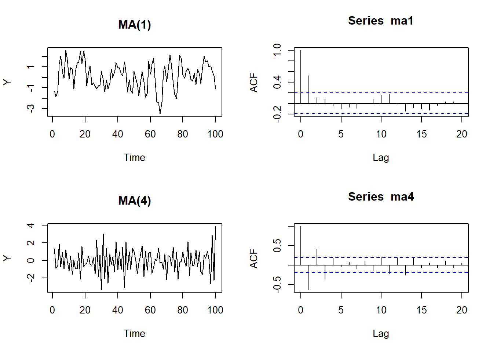
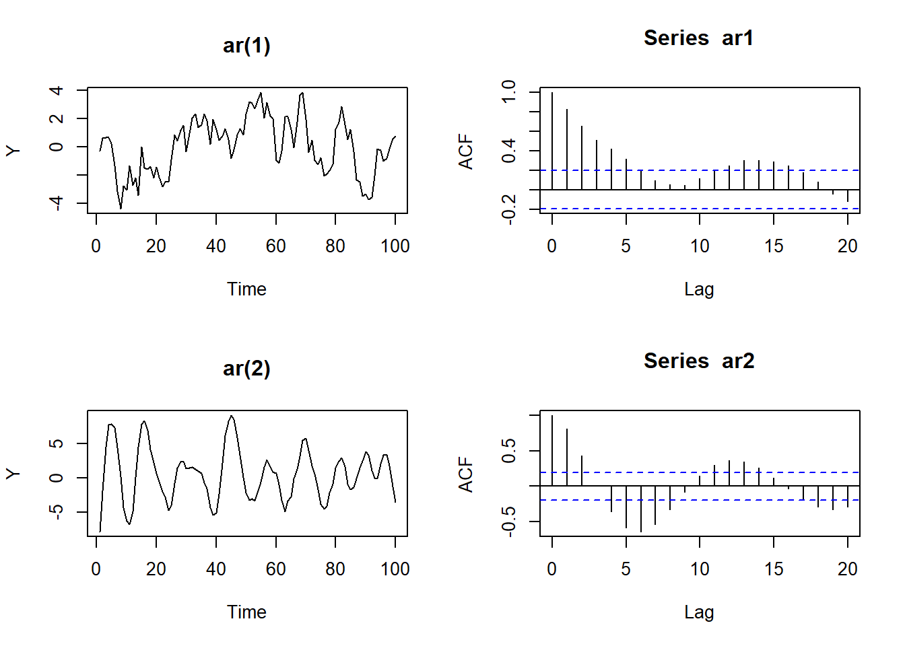

# Modelos con series estacionarias


## Estacionariedad y dependencia débil 

Retomando, decimos que un proceso de serie de tiempo es una secuencia de variables aleatorias indexadas en el tiempo. Nuestros datos, lo que observamos, es una realización de este proceso estocástico. En analogía a los datos de sección cruzada, debemos tener en cuenta que nuestros datos son una realización de muchas posibles. 

Si tengo una colección de variables aleatorias ordenadas en una secuencia y muevo esa secuencia *h* periodos adelante y la distribución de probabilidad conjunta no cambia, entonces decimos que el proceso es estacionario. Tenemos una versión estricta y una débil o en covarianza

**Estricta**

Decimos que el proceso estocástico $\{Y_t:t=1,2,...\}$ es estacionario si para toda colección de índices de tiempo $1\leq t_1<t_2<...<t_m$ la distribución conjunta de $(Y_{t_1},Y_{t_2},...,Y_{t_m})$ es igual a la de $(Y_{t_{1+h}},Y_{t_{2+h}},...,Y_{t_{m+h}}$ para todos los enteros $h\geq 1$


**En Covarianza: débil**

$\{Y_t:t=1,2,...\}$ con $E[Y_t^2<\infty]$ es estacionario en covarianza si

- $E(Y_t)=\mu$ para todo $t$

- $Var(x_t)=\gamma_0$ para todo $t$

- Para cualquier $t,j\geq1,Cov(Y_t,Y_{t+j})=\gamma_j$, es que depende solo de $j$ y no de $t$


**Dependencia débil**


- Decimos que un proceso estacionario (en covarianza) es debilmente depediente si la correlación entre $x_t$ y $x_{t+h}$ tiende a cero *rápidamente* en la medida que $h\to \infty$


- Este supuesto es importante para poder aplicar la Ley de Grandes Números y el Teorema Central del Límite, de tal manera que nos permite decir que lo que calculamos en la muestra converge a los valores poblacionales (LLN), y nos facilita la inferencia (CLT)

- Con los datos lo podemos observar usando la ACF. Si esta decae rápidamente de cero entonces es indicativo de dependencia débil


### Procesos de media móvil y autoregresivos

#### Media móvil

El ejemplo más simple de un proceso estacionario y débilmente dependiente es un proceso de media móvil de orden 1, **MA(1)**

\begin{equation}
\tag{1}
Y_t=\mu+e_t+\theta e_{t-1}
\end{equation}

Donde $e_t$ es ruido blanco. La ecuación (1) la llamamos de media móvil, **MA** porque $Y_t$ es un promedio ponderado de los choques aleatorios $e_t$ y $e_{t-1}$. Los momentos del proceso son

\begin{align}
\tag{2}
E(Y_t)&=\mu\\
Var(Y_t)&=(1+\theta^2)\sigma^2\\
\gamma_1&=\theta\sigma^2
\rho_1=\dfrac{\theta}{1+\theta^2}
\rho_k=0 \quad \text{Para}\quad k\geq2
\end{align}


El proceso de media móvil puede ser de un orden superior a 1, un proceso **MA(q)** es de la forma

$$
Y_t=\mu+e_t+\theta_1e_{t-1}+\theta_2e_{t-2}+...+\theta_qe_{t-q}
$$

La gráfica siguiente ilustra los procesos MA(1) y MA(4)


```r
library(stats)
ma1<-arima.sim(n=100,list(ma=c(0.8)))
ma4<-arima.sim(n=100,list(ma=c(-0.6,0.3,-0.5,0.5)))
par(mfrow=c(2,2))
plot(ma1,ylab="Y",main="MA(1)")
acf(ma1)
plot(ma4,ylab="Y",main="MA(4)")
acf(ma4)
```



#### Procesos autoregresivos, AR(p)

Un proceso autoregresivo de orden 1 es de la forma

$$
Y_t=c+\phi Y_{t-1}+e_t
$$

Donde $e_t$ es ruido blanco. 

Si resolvemos por sustitución

\begin{align}
t=0 \quad Y_0&=c+\phi Y_{-1}+e_0\\
t=1 \quad Y_1&=c+\phi Y_{0}+e_1 \\
\end{align}

Al reemplazar $Y_0$ obtenemos

\begin{equation}
t=1 \quad Y_1=c+\phi c+\phi^{2}y_{-1}+\phi e_{0}+e_1
\end{equation}

En $t=2$ tenemos 

\begin{equation}
Y_2=c+\phi c +\phi^2 c+\phi^{3}Y_{-1}+\phi^2e_0+\phi e_1+e_2
\end{equation}

Generalizando, llegamos a

\begin{equation}
Y_t=c(1+\phi+\phi^2+\phi^3+...+\phi^t)+\phi^{t+1}Y_{-1}+e_t+\phi e_{t-1}+\phi^2e_{t-2}+...+\phi^te_0
\end{equation}

El comportamiento de la ecuación anterior depende del valor de $\phi$. Si $\phi\neq 1$, podemos mostrar que los primeros $t$ términos de la serie geométrica $1+\phi+\phi^2+\phi^3+...+\phi^t$ converge a 

$$
\dfrac{1-\phi^{t+1}}{1-\phi}
$$

Si además $|\phi|<1$, entonces cuando $t\to\infty$ converge a $\dfrac{1}{1-\phi}$, con lo cual

$$
Y_t=\dfrac{c}{1-\phi}+e_t+\phi e_{t-1}+\phi^2e_{t-2}+\phi^3e_{t-3}+...
$$
Note que $Y_t$ tiene dos partes, un valor de equilibrio, $\dfrac{c}{1-\phi}$ y la secuencia de choques aleatorios desde el pasado remoto hasta el presente. Podemos mostrar que $Y_t$ es estacionaria

$$
E(Y_t)=\mu=\dfrac{c}{1-\phi}
$$

La varianza

\begin{align}
\gamma_0&=E(Y_t-\mu)^2\\
&=E(e_t+\phi e_{t-1}+\phi^2e_{t-2}+\phi^3e_{t-3}+...)^2\\
&=E(e_t^2)+E(\phi e_te_{t-1})+\phi^2E(e_te_{t-2})+...+\phi^2E(e_{t-1^2})+...+\phi^4E(e_{t-2}^2)+...\\
&=(1+\phi+\phi^2+\phi^4+\phi^6...)\sigma^2\\
&=\dfrac{\sigma^2}{1-\phi^2}
\end{align}

Luego la varianza no es función del tiempo

La covarianza de orden 1

\begin{align}
\gamma_1&=E(Y_t-\mu)(Y_{t-1}-\mu)\\
&=E(e_t+\phi e_{t-1}+\phi^2e_{t-2}+...)(e_{t-1}+\phi e_{t-2}+\phi^2e_{t-3}+...)\\
&=(\phi+\phi^3+\phi^5+...)\sigma^2\\
&=\phi(1+\phi^2+\phi^4+...)\sigma^2\\
&=\dfrac{\phi\sigma^2}{1-\phi^2}
\end{align}

Siguiendo el mismo procedimiento, la de orden 2 estaría dada por

$$
\gamma_2=\dfrac{\phi^2\sigma^2}{1-\phi^2}
$$
Y de manera general, para cualquier $j$

$$
\gamma_j=\dfrac{\phi^j\sigma^2}{1-\phi^2}
$$


Usando las covarianzas y la varianza podemos obtener las autocorrelaciones

$$
\rho_j=\dfrac{\gamma_j}{\gamma_0}=\phi^j
$$
**Ejercicio**

Para los siguientes procesos, calcule el valor esperado, la varianza y las autocorrelaciones hasta $j=5$. Grafique las autocorrelaciones

1. $Y_t=0.8Y_{t-1}+e_t$

2. $Y_t=1-0.6Y_{t-1}+e_t$


De forma general, un proceso AR(p) se escribe

$$
Y_t=c+\phi_1Y_{t-1}+\phi_2Y_{t-2}+...+\phi_pY_{t-p}+e_t
$$

La graífca siguiente ilustra los procesos AR(1) y AR(2)


```r
ar1<-arima.sim(n=100,list(ar=c(0.8)))
ar2<-arima.sim(n=100,list(ar=c(1.6,-0.9)))
par(mfrow=c(2,2))
plot(ar1,ylab="Y",main="ar(1)")
acf(ar1)
plot(ar2,ylab="Y",main="ar(2)")
acf(ar2)
```




#### Procesos no estacionarios

Vimos que el comportamiento del proceso AR(1) depende del valor de $\phi$. A partir de lo desarrollado anteriormente, calcule la media, la varianza y las autocorrelaciones para los siguientes procesos

1. Caminata aleatoria $Y_t=Y_{t-1}+e_t$

2. Caminata aleatoria con deriva $Y_t=c+Y_{t-1}+e_t$

3. Estacionario alrededor de tendencia determinista $Y=at+\phi Y_{t-1}+e_t$, con $|\phi|<1$


## Modelos lineales

El modelo de regresión lineal toma la forma

$$
Y_t=\mathbf{X'}_t\boldsymbol{\beta}+e_t
$$
 
 Donde $\mathbf{X}_t$ es el vector de regresores, que puede incluir rezagos de $Y_t$ $(Y_{t-1},...,Y_{t-p})$, y
 $$
 \boldsymbol{\beta}=(E(\mathbf{X'_tX_t}))^{-1}E(\mathbf{X_tY_t})
 $$ es el vector de coeficientes
 
Decimos que si se cumplen los siguientes supuestos 

- **TS1**: $(Y_t,X_t)$ es estacionario y débilmente dependiente

- **TS2**: No hay colinealidad perfecta

- **TS3**: $E(e_t|\mathbf{X}_t)=0$, es decir que las explicativas son contemporáneamente exógenas

Entonces el estimador MCO es consistente, $plim \hat{\beta}\to \beta$

### Modelos estáticos, de rezagos distribuidos, y ARDL 

Considere que $\mathbf{X_t}$ contiene únicamente las variables $Z_{1t}, Z_{2t}$, nuestro modelo es entonces

$$
Y_t=\beta_0+\beta_1Z_{1t}+\beta_2Z_{2t}+e_t
$$

Bajo el supuesto que las series son estacionarias y débilmente dependientes, podemos estimar consistentemente los parámetros siempre y cuando el error no esté correlacionado contemporáneamente con las variables independientes. 

Si permitimos que los valores pasados de los regresores tengan impacto en $Y_t$, entonces tenemos un modelo de rezagos distribuidos

$$
Y_t=\beta_0+\beta_1Z_{t}+\beta_2Z_{t-1}+e_t
$$

En este modelo los parámetros $\beta_i$ capturan cada uno el impacto sobre $Y_t$, mientras que la suma $\beta_1+\beta_2$ es el impacto acumulado. Los modelos anteriores pueden no capturar adecuadamente la dinámica de $Y_t$ pues ignoran los valores rezagados de $Y$. Si los incluimos, tenemos un modelo ARDL

$$
Y_t=\alpha_0+\alpha_1Y_{t-1}+\alpha_2Y_{t-2}+...+\alpha_pY_{t-p}+\beta_1Z_{t}+\beta_2Z_{t-1}+...+\beta_qZ_{t-q}+e_t
$$


Si tenemos un modelo ARDL(1,1) como sigue

$$
Y_t=\alpha_0+\alpha_1Y_{t-1}+\beta_1Z_t+\beta_2Z_{t-1}+e_t
$$

Podemos mostrar que el impacto acumulado o multiplicador de largo plazo en este caso es

$$
\dfrac{\alpha\beta_1+\beta_2}{1-\alpha_1}
$$
el cual es una función no lineal de los coeficientes.

#### Correlación serial

En un modelo con series temporales es importante incorporar los rezagos necesarios para capturar la dinámica del proceso. Decimos que un modelo es dinámicamente completo si hemos incluido sufientes rezagos tal que rezagos adicionales no tienen poder predictivo sobre $Y_t$. Cuando esto es así, entonces no hay correlación serial

$$
E(e_te_s|\mathbf{X}_t,\mathbf{X}_s)=0 \quad \text{Para todo}\quad t\neq s
$$
Por ejempplo, suponga que el modelo correcto es $Y_t=\alpha_0+\alpha_1Y_{t-1}+\beta_1Z_t+\beta_2Z_{t-1}+e_t$, pero estima $Y_t=\alpha_0+\beta_1Z_t+\beta_2Z_{t-1}+u_t$. Como $u_t=\alpha_1Y_{t-1}+e_t$ y $u_{t-1}=\alpha_1Y_{t-2}+e_{t-1}$, entonces es claro que debido a la correlación de $Y_{t-1}$ con $Y_{t-2}$ entonces $u_t$ y $u_{t-1}$ están correlacionados. 

Así, en la mayoría de los casos, debemos revisar que los residuales del modelo no tengan evidencia de autocorrelación.

#### Ejemplos

**1.Curva de Phillips Estática**

Si tenemos que las expectativas son constantes y la tasa natural de desempleo es constante, entonces podemos escribir

$$
\pi_t=\alpha+\beta td_t+e_t
$$


Usamos datos mensuales de la inflación anual y la tasa de desempleo. Primero hacemos un análisis gráfico de nuestras series


```r
library(fpp3)
library(readxl)
library(ggpubr)
mes<- read_excel(here("Econometria2","Data","tsmonth.xlsx"))
mes<-mes%>%mutate(date=yearmonth(date))%>%as_tsibble(index=date)
mes<-mes%>%mutate(inf=difference(log(ipc),lag=12),td13=td13/100)%>%na.omit()
```


```r
inf.plot<-mes%>%autoplot(inf)
td.plot<-mes%>%autoplot(td13)
ggarrange(inf.plot,td.plot,ncol=1)
```


La serie de desempleo tiene una estacionalidad marcada. Trabajaremos con la serie estacionalmente ajustada, como se muestra a continuación


```r
tdsad<-mes%>%model(stl=STL(td13))
tds<-components(tdsad)%>%as_tsibble()%>%mutate(tdsa=season_adjust)%>%select(tdsa)
mes<-mes%>%left_join(tds)
mes%>%autoplot(td13,color="gray")+geom_line(aes(y=tdsa),colour="#0072B2")
```


Examinamos los correlogramas


```r
par(mfrow=c(1,3))
acf(mes$inf)
acf(mes$td13)
acf(mes$tdsa)
```


Si hacemos el gráfico estándar de la curva de Phillips encontramos una pendiente levemente positiva


```r
ggplot(mes,aes(x=tdsa,y=inf))+geom_point(aes(colour = factor(year(date))))+
  theme(legend.position = "none")+labs(y="Inflación",x="TD")+stat_smooth(method="lm")
```


Procedemos a estimar el modelo


```r
pstatic<-mes%>%model(TSLM(inf~tdsa))
report(pstatic)
```

```
Series: inf 
Model: TSLM 

Residuals:
      Min        1Q    Median        3Q       Max 
-0.031583 -0.011970 -0.002587  0.012863  0.043743 

Coefficients:
            Estimate Std. Error t value Pr(>|t|)    
(Intercept) 0.035297   0.005105   6.915 4.22e-11 ***
tdsa        0.065009   0.039114   1.662   0.0978 .  
---
Signif. codes:  0 '***' 0.001 '**' 0.01 '*' 0.05 '.' 0.1 ' ' 1

Residual standard error: 0.0171 on 240 degrees of freedom
Multiple R-squared: 0.01138,	Adjusted R-squared: 0.00726
F-statistic: 2.762 on 1 and 240 DF, p-value: 0.097806
```

La estimación no sugiere un trade-off entre empleo e inflación para el periodo analizado


```r
res<-residuals(pstatic)
acf(res$.resid)
```


Los residuales no se comportan como ruido blanco. La autocorrelación sugiere que hay información que no hemos aprovechado. El modelo no es dinámicamente completo

**2. Phillips con expectativas adaptativas**

Si ahora fomulamos nuestro modelo como unja curva de Phillips con expectativas, suponiendo expectativas adaptativas

\begin{align}
&\pi_t=\pi_{t-1}+\beta(td_t-td^n)+e_t\\
&\pi_t-\pi_{t-1}=\beta(td_t-td^n)+e_t
\end{align}


Si $\alpha=-\beta td^n$, entonces estimamos el modelo


$$
\Delta \pi_t=\alpha+\beta td_t+e
$$


Donde $\Delta \pi_t=\pi_t-\pi_{t-1}$


```r
mes<-mes%>%mutate(dinf=difference(inf))
pex<-mes%>%model(TSLM(dinf~tdsa))
report(pex)
```

```
Series: dinf 
Model: TSLM 

Residuals:
       Min         1Q     Median         3Q        Max 
-0.0091936 -0.0020116 -0.0001539  0.0016344  0.0136299 

Coefficients:
              Estimate Std. Error t value Pr(>|t|)  
(Intercept)  0.0020880  0.0009977   2.093   0.0374 *
tdsa        -0.0162264  0.0076602  -2.118   0.0352 *
---
Signif. codes:  0 '***' 0.001 '**' 0.01 '*' 0.05 '.' 0.1 ' ' 1

Residual standard error: 0.003322 on 239 degrees of freedom
Multiple R-squared: 0.01843,	Adjusted R-squared: 0.01432
F-statistic: 4.487 on 1 and 239 DF, p-value: 0.035184
```

De acuerdo a la estimación puntual, un aumento de un punto en la tasa de desempleo disminuye la inflación no anticipada en 0.016 puntos. Podemos calcular $td^n=-\alpha/\beta$, lo que nos da 0.1286792. En línea con ejercicios que estiman la NAIRU para Colombia.


```r
res2<-residuals(pex)
acf(res2$.resid,na.action=na.omit)
```


**3. Hipótesis de mercados eficientes**

La eficiencia de los mercados se fundamenta en la idea que el precio de los activos refleja toda la información disponible. Una de las implicaciones es que los retornos pasados no ayudan a pronosticar los retornos futuros de los activos. Esto ha dado lugar a la proposición que los precios siguen una caminata aleatoria


Si decimos que $r_t=lnP_t-lnP_{t-1}$ es el retorno en $k$ periodos, decimos que sigue caminata aleatoria si


$$
lnP_t=lnP_{t-1}+e_t
$$

Y por lo tanto

$$
r_t=\Delta lnP_t=e_t
$$


```r
library(quantmod)
getSymbols('EC',src="yahoo")
```

```
[1] "EC"
```

```r
ECW<-EC[.indexwday(EC)==3]
ECW<-ECW[,"EC.Close"]
ECW$lp<-log((ECW$EC.Close))
ECW$r<-diff(ECW$lp)
ECW<-na.omit(ECW)
par(mfrow=c(2,1))
plot(ECW$lp)
plot(ECW$r)
```


```r
par(mfrow=c(2,1))
acf(ECW$lp)
acf(ECW$r)
```


Note que en el caso de los retornos indican dependencia débil. Apliquemos ahora un modelo de regresión. 

$$
r_t=\alpha+\beta r_{t-1}+e_t
$$

<br/>

Bajo la hipótesis de caminata aleatoria $\beta=0$. Bajo la nula se cumple exogeneidad y por lo tanto podemos estimar consistentemente $\beta$ usando MCO


```r
emh<-lm(r~lag(r,n=1),data=ECW)
summary(emh)
```

```

Call:
lm(formula = r ~ lag(r, n = 1), data = ECW)

Residuals:
     Min       1Q   Median       3Q      Max 
-0.50226 -0.02672  0.00193  0.03015  0.30591 

Coefficients:
                Estimate Std. Error t value Pr(>|t|)
(Intercept)   -0.0006283  0.0021953  -0.286    0.775
lag(r, n = 1)  0.0621623  0.0378083   1.644    0.101

Residual standard error: 0.0582 on 701 degrees of freedom
  (1 observation deleted due to missingness)
Multiple R-squared:  0.003841,	Adjusted R-squared:  0.00242 
F-statistic: 2.703 on 1 and 701 DF,  p-value: 0.1006
```


```r
acf(emh$residuals)
```


